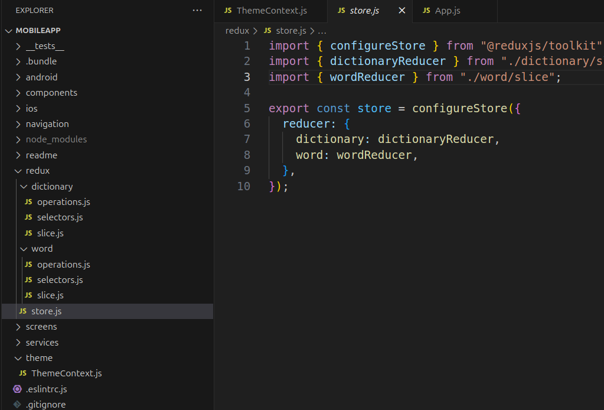
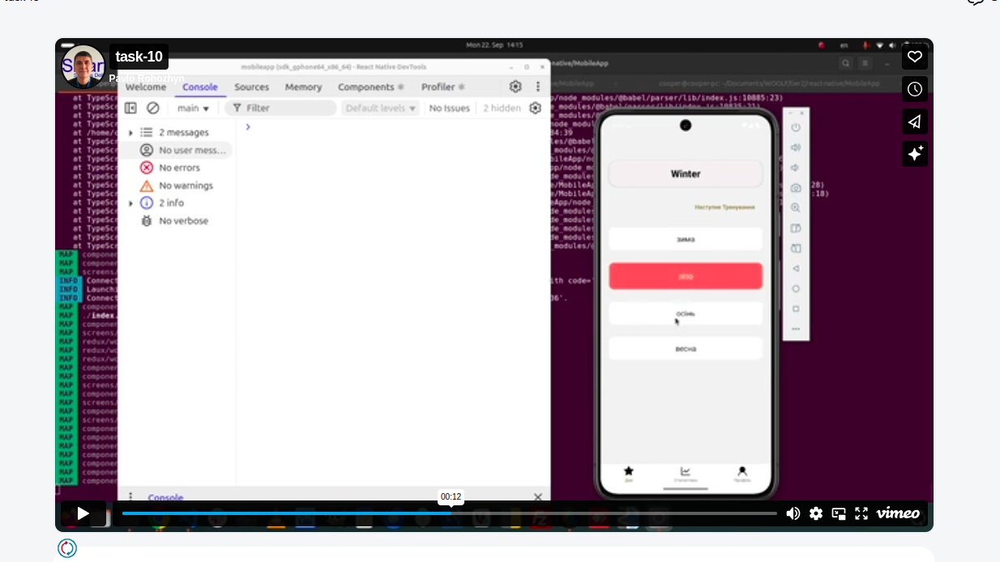
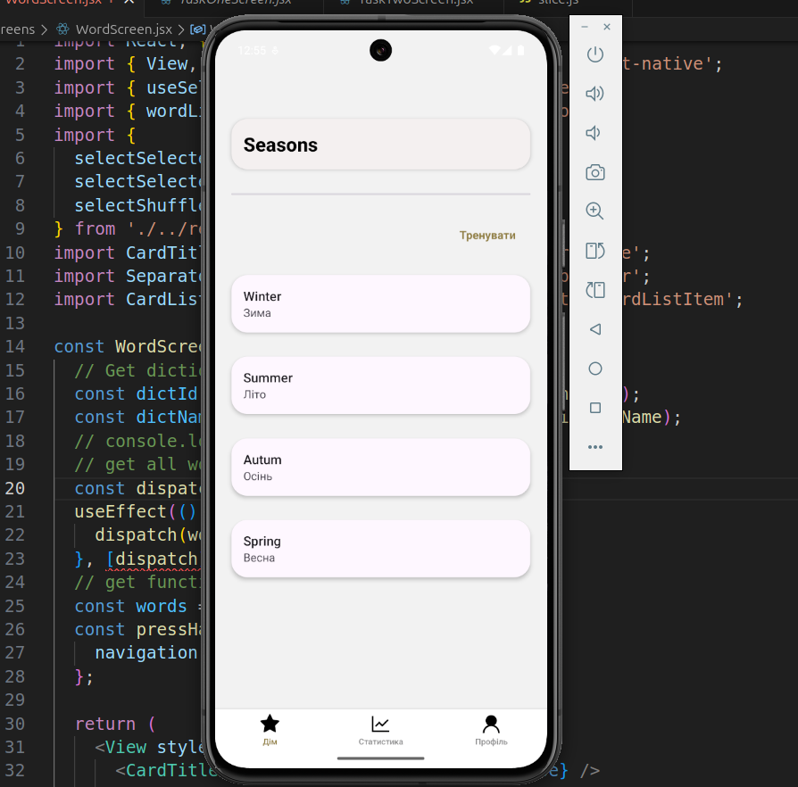

### Cross Assigment 1

> MobileApp Design
> 
<br />
:paperclip: Figma design file <a href="./readme/cross_assignment_1/cross_assigment_1.fig">cross_assigment_1.fig</a>
<br />
<br />

### Cross Assigment 2

> MobileApp Design
> 
<br />
:paperclip: Figma design file <a href="./readme/cross_assignment_2/cross_assigment_2.fig">cross_assigment_2.fig</a>
<br />
<br />

### Cross Assigment 3

> Components
> 
<br />
:paperclip: Source branch <a href="https://github.com/PavloRohozhyn/MobileApp/tree/cross_assignment_3">cross_assignment_3</a>
<br />
<br />

### Cross Assigment 4

> Navigation
> 
<br />
:paperclip: Source branch <a href="https://github.com/PavloRohozhyn/MobileApp/tree/cross_assignment_4">cross_assignment_4</a>
<br />
:paperclip: <a href="https://vimeo.com/1120356077">Live Demo</a>
<br />
<br />

### Cross Assigment 5

> API Calls
> 
<br />
:paperclip: Source branch <a href="https://github.com/PavloRohozhyn/MobileApp/tree/cross_assignment_5">cross_assignment_5</a><br />
:paperclip: <a href="https://vimeo.com/1120356068">Live Demo</a>
<br />
<br />

### Cross Assigment 6

> Context APi & Redux Toolkit
> 
<br />
:paperclip: Source branch <a href="https://github.com/PavloRohozhyn/MobileApp/tree/cross_assignment_6">cross_assignment_6</a><br />
:paperclip: <a href="./readme/cross_assignment_6/theme.png">ScreenShot - Theme (Contex API)</a><br />
:paperclip: <a href="./readme/cross_assignment_6/redux.png">ScreenShot - State Manager (Redux Toolkit)</a><br />
:paperclip: <a href="./readme/cross_assignment_6/main.png">ScreenShot - implementing App.js</a><br />
<br />
<br />

### Cross Assigment 7

> Animation & Perfomance Optimizathion
> 
<br />
:paperclip: Source branch <a href="https://github.com/PavloRohozhyn/MobileApp/tree/cross_assignment_7">cross_assignment_7</a><br />
:paperclip: <a href="https://vimeo.com/1120810364">Live Demo</a></br />
</br />
</br />

### Cross Assigment Final

> Final Task
> 
<br />
:paperclip: Source branch <a href="https://github.com/PavloRohozhyn/MobileApp/tree/cross_final_project">cross_final_project</a><br />
:paperclip: <a href="https://vimeo.com/1121125212">Live Demo</a></br />
</br />
<ul>
 <li>added api calls for profile screen</li>
 <li>added api cals for statistic screen</li>
 <li>rewrite home screen from simple function to redux</li>
 <li>added second step for learn</li>
 <li>added "shuffle words functionale" for fisrst and second steps</li>
 <li>fix bugs</li>
</ul>
</br />


### Project Config

> **Note**: Make sure you have completed the [Set Up Your Environment](https://reactnative.dev/docs/set-up-your-environment) guide before proceeding.

### Start Metro

First, you will need to run **Metro**, the JavaScript build tool for React Native.

To start the Metro dev server, run the following command from the root of your React Native project:

```sh
# Using npm
npm start

# OR using Yarn
yarn start
```

### Build and run your app

With Metro running, open a new terminal window/pane from the root of your React Native project, and use one of the following commands to build and run your Android or iOS app:

### Android

```sh
# Using npm
npm run android

# OR using Yarn
yarn android
```
